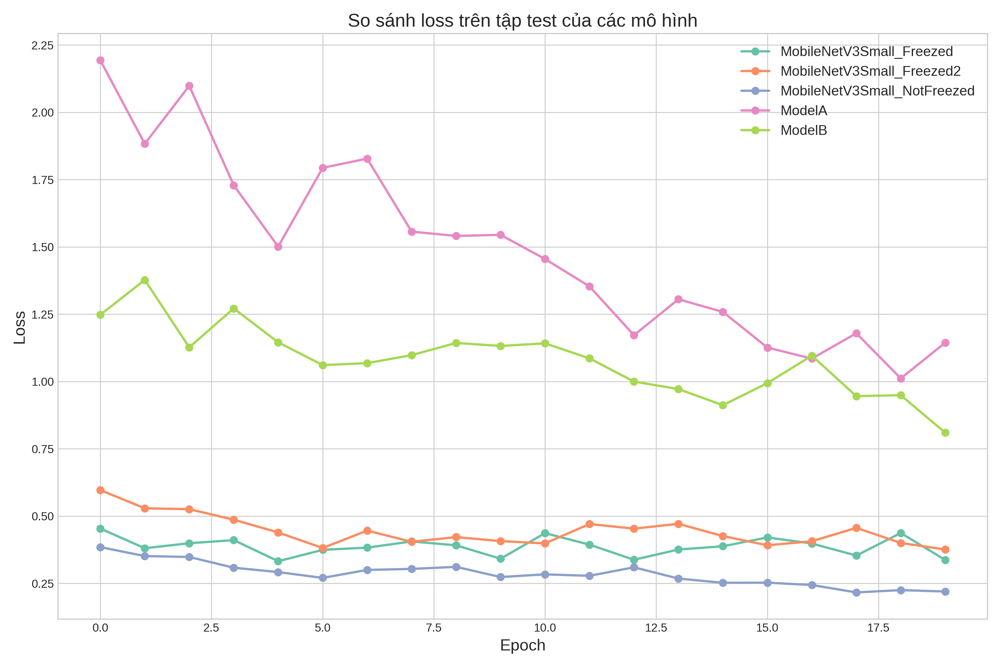
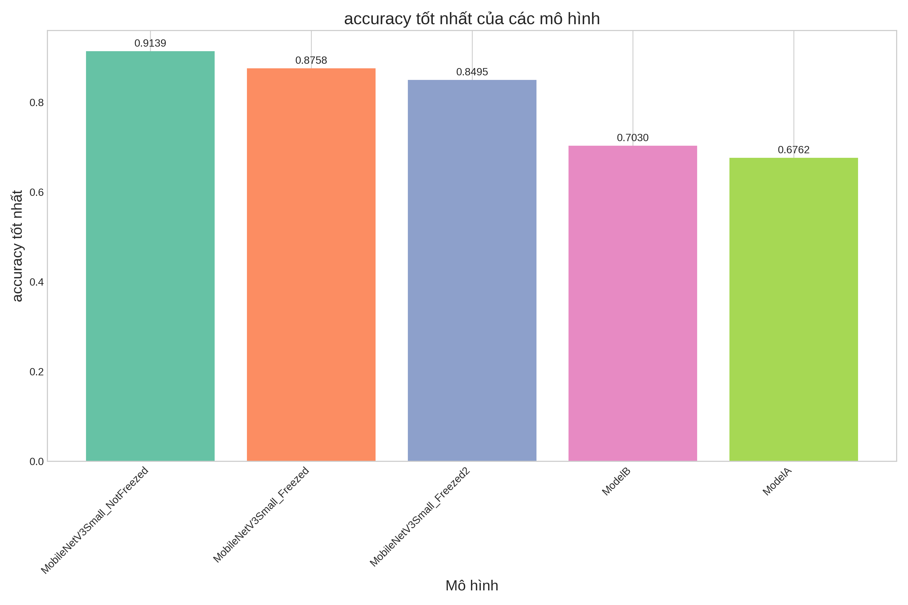

# Tóm tắt kết quả huấn luyện các mô hình

## Bảng so sánh hiệu suất tốt nhất

| Model                       |   Best Test Accuracy |   Epoch of Best Accuracy |   Best Test Loss |   Epoch of Best Loss |   Final Test Accuracy |   Final Test Loss |
|:----------------------------|---------------------:|-------------------------:|-----------------:|---------------------:|----------------------:|------------------:|
| MobileNetV3Small_NotFreezed |             0.913866 |                       17 |         0.216249 |                   17 |              0.913603 |          0.219641 |
| MobileNetV3Small_Freezed    |             0.875788 |                        4 |         0.332158 |                    4 |              0.855567 |          0.33695  |
| MobileNetV3Small_Freezed2   |             0.849527 |                       18 |         0.375706 |                   19 |              0.848214 |          0.375706 |
| ModelB                      |             0.702994 |                        2 |         0.80942  |                   19 |              0.699317 |          0.80942  |
| ModelA                      |             0.676208 |                        4 |         1.01138  |                   18 |              0.639443 |          1.14419  |

## Phân tích kết quả

- Mô hình có accuracy cao nhất là **MobileNetV3Small_NotFreezed** với accuracy **0.9139**.
- accuracy trung bình của các mô hình: **0.8037 ± 0.1070**.
- Thời gian hội tụ trung bình (epoch): **9.0**.

## Biểu đồ

